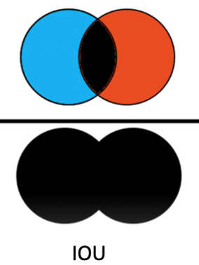

# Road Segmentation for Self-Driving Cars

## Objective:
The global market for self-driving cars has been on a rise with the market size projected to grow from 20.3 million units in 2021 to 62.4 million units by 2030, a CAGR on 13.3%. Among the many challenges associated with designing self-driving cars, one challenge that we are particularly interested in is designing a machine learning model that can accurately detect road lanes. In this project I have created an image segmentation model that tries to accurately identify the pixels corresponding to the road from a given dash cam image.

## Dataset:
The dataset that I will be using in this project is the Cambridge-driving Labeled Video Database (CamVid) which is a collection of frames from videos taken from a front dash cam of cars. The dataset is labelled with 32 categories that includes buildings, trees, sidewalk, etc. but due to computational limitations I will be working with only a single class “road”. So, this project deals with a binary segmentation problem, where road pixels would be indicated by 1 and the remaining pixels in the image would be indicated by 0.

## Accuracy Metrics:
We used 2 metrics to evaluate our models: Intersection over Union (IoU) and Dice Score, both of which are metrics that quantify the degree of overlap in the true and the predicted image, where IoU is more sensitive to extreme errors.

- Intersection over Union (IoU): This metric gives the ratio of intersection area of true and predicted image to the union area true and predicted image.

- Dice Score: This metric gives the ratio of two times the intersection area of true and predicted image to the sum of areas true and predicted image.

     
## Models: 
3 models were created in for classifying road pixels. A baseline CNN model, DeepLab V3 and UNet.

- Baseline CNN: A CNN architecture was used as baseline for this project. The CNN architecture contains two convolution (num_filters=64, filter_size=3, stride=2, activation=“relu”) and pooling layers (size=2) in the encoder section, and two transpose convolution and unpooling layers in the decoder section. The mean IoU score obtained on the validation set was about 61.85% and the mean dice score was about 63.32%

- DeepLab V3: DeepLab V3 is a pre-trained image segmentation model trained on the ImageNet dataset. DeepLab V3 also constitutes an encoder-decoder CNN sections with 4 improvement to the model.

-- Depthwise Separable Convolutions: Instead of using traditional convolution layers, the DeepLabV3 architecture splits the task into depthwise convolutions and pointwise convolutions which significantly reduces the computation time required.
-- Spatial Pyramid Pooling: This layer removes the fixed input size constraint of the input images.
-- Atrous Convolutions: Atrous convolutions provide a way to apply a filter over a larger area of the given image which helps in capturing the broader contextual information.
The mean IoU score obtained on the validation set was 90.89% and the mean dice score was approx 93.00%

- U-Net: (Insert Description)

## Performance Comparision:

## Inference on Test Set:

## Conclusion:
