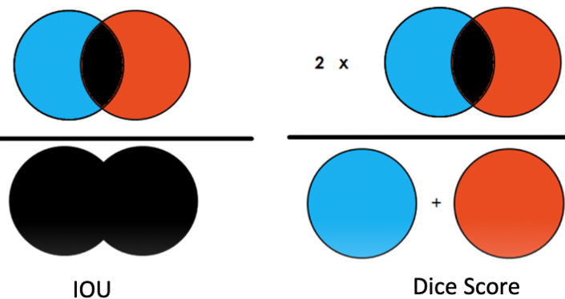
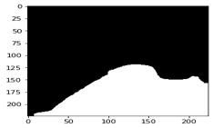
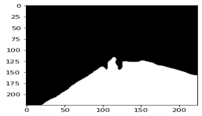

# Road Segmentation for Self-Driving Cars

## Objective:
The global market for self-driving cars has been on a rise with the market size projected to grow from 20.3 million units in 2021 to 62.4 million units by 2030, a CAGR on 13.3%. Among the many challenges associated with designing self-driving cars, one challenge that we are particularly interested in is designing a machine learning model that can accurately detect road lanes. In this project I have created an image segmentation model that tries to accurately identify the pixels corresponding to the road from a given dash cam image.

 

## Dataset:
The dataset that I will be using in this project is the Cambridge-driving Labeled Video Database (CamVid) which is a collection of frames from videos taken from a front dash cam of cars. The dataset is labelled with 32 categories that includes buildings, trees, sidewalk, etc. but due to computational limitations I will be working with only a single class “road”. So, this project deals with a binary segmentation problem, where road pixels would be indicated by 1 and the remaining pixels in the image would be indicated by 0.

 

## Accuracy Metrics:
We used 2 metrics to evaluate our models: Intersection over Union (IoU) and Dice Score, both of which are metrics that quantify the degree of overlap in the true and the predicted image, where IoU is more sensitive to extreme errors.

- Intersection over Union (IoU): This metric gives the ratio of intersection area of true and predicted image to the union area true and predicted image.

- Dice Score: This metric gives the ratio of two times the intersection area of true and predicted image to the sum of areas true and predicted image.

    

 

## Models: 
3 models were created in for classifying road pixels. A baseline CNN model, DeepLab V3 and UNet.

- **Baseline CNN**: A CNN architecture was used as baseline for this project. The CNN architecture contains two convolution (num_filters=64, filter_size=3, stride=2, activation=“relu”) and pooling layers (size=2) in the encoder section, and two transpose convolution and unpooling layers in the decoder section. The mean IoU score obtained on the validation set was about 61.85% and the mean dice score was about 63.32%

- **DeepLab V3**: DeepLab V3 is a pre-trained image segmentation model trained on the ImageNet dataset. DeepLab V3 also constitutes an encoder-decoder CNN sections along with Spatial Separable Convolution, Spatial Pyramid Pooling and Atrous Convolution. The mean IoU score obtained on the validation set was 90.89% and the mean dice score was approx 93.00%

- **U-Net**: U-net is a pre-trained image segmentation model trained on the ImageNet dataset. U-Net also constitutes an encoder-decoder CNN sections along with skip connections added between the convolution and transpose convolution layers which helps in recovering fine-grained details in the decoder section.
The base U-Net model outperformed the other 2 models that we had used, and hence I decided to improve the model further to improve its accuracy. Adding image augmentation, unfreezing few layers, model checkpoint, reducing learning rate and increasing number of epochs were some of the steps taken to boost the model accuracy. The mean IoU score obtained on the validation set was 97.30% and the mean dice score was 98.04%

 

## Performance Comparision:
IOU and Dice Scores were used to compare the accuracy of the models on the validation set. Along with those metrics the training time per epoch and the time it takes to run the model on a single image (inference time) for all the models in Colab Pro is also summarized in the below table.

|                 | Baseline CNN    |    Deeplab V3   |      U-Net      |
|:---------------:|:---------------:|:---------------:|:---------------:|
| IOU Score       |       61.85%    |90.84%           |97.20%           |
| Dice Score      | 63.32%          |93.34%           |98.05%           |
| Training Time   | 3.916 sec       |13.87 sec        |5.23 sec         |
| Inference Time  | 0.011 sec       |0.089 sec        |0.022 sec        |

 

 

The below images show how the models performed on a single validation image:

True Image                                                |  True Mask
:-------------------------:                               |:-------------------------:
  |  

Baseline CNN Prediction      | DeepLab V3 Prediction      | U-Net Prediction      
:-------------------------:|:-------------------------:   |:-------------------------:   
  |  |  

 

## Inference on Test Set:
The U-Net model gave a mean IOU score of 91.89% and dice score of 93.51% on the test data set.

The image below shows the prediction of the final model on a sample test image.

Image                                                     |  Prediction
:-------------------------:                               |:-------------------------:
  |  

 

## Conclusion:
U-Net model seems to outperform other models in terms of accuracy providing an IoU of 91.89% and Dice score of 93.51% on unseen test set. Along with providing a better accuracy, U-Net also evaluates images 4 times faster than the DeepLab V3 model.

However, the model does seem to overfit a bit, and adding regularization to the model might help with performance over test set.
